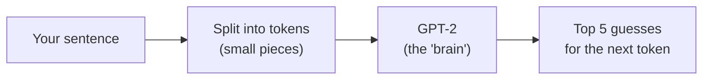

# 1. Tokenizer Playground

> 🌐 **No terminal? Try this demo in your browser — nothing to install:**
> https://khadir-syed.github.io/k_ai-basics/web/01/

## What is this?

Imagine you have a big box of Lego bricks. You can't build anything with
one giant brick — you need lots of small ones that snap together.

Computers are the same with words. A computer can't "read" a sentence like
we do. First it has to break the sentence into small pieces, called
**tokens**. A token might be a whole word, part of a word, or even just a
space. Then the computer looks at those pieces and guesses: "what small
brick comes next?"

This demo shows you both of those steps, live, in your terminal.

## How it works, in a picture



## What you need

- Python installed on your computer (ask a grown-up if you're not sure).
- Nothing else to sign up for. No password, no account, no credit card.

## How to run it, step by step

**1. Open your terminal.**
This is the box on your computer where you can type commands.

**2. Walk into this folder.**
This is like walking into the toy room where this demo lives:

```bash
cd 01-tokenizer-playground
```

**3. Make a clean little box for this demo's tools.**
This keeps this demo's toys separate from everything else on your
computer, so nothing gets mixed up:

```bash
python3 -m venv .venv
```

**4. Open that little box.**
Now you're "inside" the clean box:

```bash
source .venv/bin/activate
```

You'll know it worked because you'll see `(.venv)` show up at the start
of your terminal line.

**5. Give it its tools.**
This downloads the two little helper packages the demo needs:

```bash
pip install -r requirements.txt
```

This part is quick.

**6. Run the demo.**
Type this, with any sentence you like inside the quotes:

```bash
python run.py "The cat sat on the"
```

**7. Be patient the first time.**
The very first time only, it downloads a "brain" called GPT-2 (about
500 MB — like downloading a movie). You'll see a progress bar. This can
take a few minutes depending on your internet. Every time after this,
it's fast, with no internet needed.

**8. Look at what it shows you.**
You'll see two things:
1. A table — your sentence chopped into little pieces called tokens,
   each with a number (that number is how the computer "sees" that
   token).
2. A bar chart — the computer's top 5 guesses for what token comes next,
   like a guessing game, with how confident it is about each guess.

> 📅 **Example output, as of 23 September 2026.** This is a real run, copied
> here so you can see what to expect. If the demo changes later, your output
> may look a little different — that's okay.

```
Your sentence, split into tokens:

  #  TOKEN                      ID
----------------------------------
  0  The                       464
  1   cat                     3797
  2   sat                     3332
  3   on                       319
  4   the                      262

Top 5 guesses for the next token:

floor           ##   7.6%
bed             ##   6.5%
couch           ##   5.4%
ground          ##   5.2%
edge            #   4.8%
```

**What am I looking at?** The computer cut "The cat sat on the" into 5
Lego bricks. See the little space before `cat`? The space is *part of* the
brick. Each brick has a number — that number is the only thing the
computer really sees. Then it guessed the next brick: "floor" is its
favourite, but only 7.6% sure. It's not *knowing* — it's guessing, just
like you would.

**9. (Optional) Try your own sentence.**
Run step 6 again with a different sentence in the quotes and watch the
guesses change.

**10. Close the box when you're done.**

```bash
deactivate
```

## No API key needed

This demo never asks you for a key, a password, or an account. Everything
happens on your own computer.
