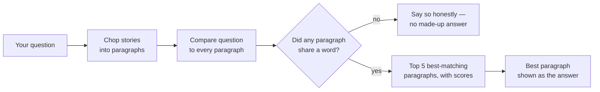

# 2. Mini-RAG in a Terminal

## What is this?

Imagine you have a stack of storybooks and a friend asks you a question. You
don't know the answer by heart, so you flip through the books, find the
paragraph that talks about it, and read that part out loud.

That's exactly what this demo does. It has 4 short childhood stories saved
as text files. You type a question, and it flips through every paragraph in
every story, finds the ones that talk about your question the most, and
shows you which paragraphs matched best — and how well.

This is called **RAG**: "Retrieval-Augmented Generation." The fancy name
just means "look something up, then use what you found." This demo shows
you the "look something up" part in plain sight — no hidden magic.

## How it works, in a picture



## What you need

- Python installed on your computer.
- Nothing else to sign up for, by default. No password, no account, no
  credit card.

## How to run it, step by step

**1. Open your terminal and walk into this folder:**

```bash
cd 02-mini-rag
```

**2. Make a clean little box for this demo's tools:**

```bash
python3 -m venv .venv
source .venv/bin/activate
```

**3. Give it its tools:**

```bash
pip install -r requirements.txt
```

**4. Ask it a question about the stories:**

```bash
python ask.py "Why did the wolf blow down the straw house?"
```

**5. Look at what it shows you.**
You'll see a bar chart of the 5 paragraphs that matched your question best
— which story they came from and how confident the match is — followed by
the single best paragraph shown as the answer.

> 📅 **Example output, as of 23 September 2026.** This is a real run, copied
> here so you can see what to expect. If the demo changes later, your output
> may look a little different — that's okay.

```
Top 5 story paragraphs that best match your question:

three_little_pigs.txt    #########             44.9%
    The wolf huffed and puffed with all his might, but the brick house ...
three_little_pigs.txt    ########              39.0%
    One day a hungry wolf came prowling through the woods and found the...
...  (3 more rows)

📄 Retrieval-only mode — showing the best-matching paragraph as the answer:

The wolf huffed and puffed with all his might, but the brick house did not
budge. No matter how hard he tried, the wolf could not blow the sturdy brick
house down, and the three pigs stayed safe inside.
```

**What am I looking at?** It flipped through every paragraph and gave each
one a score — more `#` means more matching words. The pigs story won, which
is right. But look closely: you asked about the **straw** house, and it
picked the **brick** house paragraph! That's because "wolf", "blow" and
"house" show up there a lot. It matches *words*, not *meaning* — see the
next section.

**6. Try your own questions.**
The 4 stories are: *The Tortoise and the Hare*, *The Three Little Pigs*,
*The Boy Who Cried Wolf*, and *The Ant and the Grasshopper*. Ask about any
of them and watch which paragraphs get picked.

**7. Close the box when you're done:**

```bash
deactivate
```

## Why some matches aren't perfect

This demo matches questions to paragraphs by comparing the *exact words*
used (a technique called TF-IDF), not by understanding meaning. Ask "why
did the wolf destroy the house" and it works great, because "wolf" and
"house" are in the text. Ask "what happens when you're dishonest" and it
may pick a weaker match, because the word "lie" isn't the same as "cried
wolf" to a word-matching search. That's not a bug — it's the real
limitation of this technique, and part of what this demo is here to show
you.

## What if nothing matches at all?

If you ask about something that isn't in any story — like "tax rules for
crypto" — not a single word lines up. The demo then tells you "nothing to
answer from" instead of pretending. That's the honest thing to do: if you
can't find it in the books, you say "I don't know," you don't make it up.

> 📅 Example output, as of 23 September 2026.

```
$ python ask.py "tax rules for crypto"

🤷 None of the stories share any words with your question, so there's nothing to answer from. Try asking about one of the stories.
```

## Optional: real generated answers with an API key

By default this demo only *retrieves* — it never writes new sentences, it
just shows you the best-matching paragraph. If you want a real, freshly
written answer instead, set an API key as an environment variable and add
`--key`:

```bash
export ANTHROPIC_API_KEY="your-key-here"
python ask.py "Why did the wolf blow down the straw house?" --key
```

`OPENAI_API_KEY` also works if you don't have an Anthropic key (Anthropic
is used first if both are set). Without `--key`, this demo **never** makes
an internet call and **never** needs a key at all.

**Which AI model does it use?** Right now it uses `claude-haiku-4-5`
(Anthropic) or `gpt-4o-mini` (OpenAI) — small, fast, cheap models. AI
companies bring out new models all the time, like new versions of a toy. If
you want to try a newer one, open [`llm.py`](llm.py), find the two lines
near the top that start with `ANTHROPIC_MODEL` and `OPENAI_MODEL`, and put
the new model's name between the quotes.

**What's `llm.py`?** It's the little messenger that carries your question to
the AI company's computer and brings the answer back. It's only used when
you add `--key` — without `--key`, it just sits there doing nothing. The
same messenger file lives in every demo that has a `--key` mode, so each
folder still works on its own.

**Using a different AI service (optional).** Think of `llm.py` as a
messenger who normally goes to one of two post offices: Anthropic's or
OpenAI's. Lots of other AI services use the same "OpenAI-style" language, so
you can give the messenger a different address and a different model name
instead. For example, to use an AI gateway running on your own computer:

```bash
export OPENAI_API_KEY="your-key-for-that-service"
export OPENAI_BASE_URL="http://localhost:20128/v1"
export LLM_MODEL="the-model-name-that-service-uses"
```

The three settings:

| Setting | What it does | If you don't set it |
|---|---|---|
| `LLM_MODEL` | Which model to ask | Uses the model named in `llm.py` |
| `OPENAI_BASE_URL` | Where OpenAI-style questions go | `https://api.openai.com/v1` |
| `ANTHROPIC_BASE_URL` | Where Anthropic-style questions go | `https://api.anthropic.com` |

Two things to know:
- If `ANTHROPIC_API_KEY` is set, it always wins — the messenger goes to the
  Anthropic-style address and ignores `OPENAI_BASE_URL`. Run
  `unset ANTHROPIC_API_KEY` first if you want the OpenAI-style service.
- Some models "think" before answering. If one uses up all its room
  thinking, the answer can come back empty — try a different model.

(Tested on 23 September 2026 with the `groq/openai/gpt-oss-20b` model
through a local OmniRoute gateway.)
