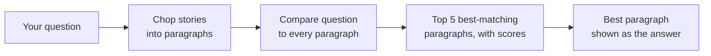

# 2. Mini-RAG in a Terminal

## What is this?

Imagine you have a stack of storybooks and a friend asks you a question. You
don't know the answer by heart, so you flip through the books, find the
paragraph that talks about it, and read that part out loud.

That's exactly what this demo does. It has 4 short childhood stories saved
as text files. You type a question, and it flips through every paragraph in
every story, finds the ones that talk about your question the most, and
shows you which paragraphs matched best — and how well.

This is called **RAG**: "Retrieval-Augmented Generation." The fancy name
just means "look something up, then use what you found." This demo shows
you the "look something up" part in plain sight — no hidden magic.

## How it works, in a picture



## What you need

- Python installed on your computer.
- Nothing else to sign up for, by default. No password, no account, no
  credit card.

## How to run it, step by step

**1. Open your terminal and walk into this folder:**

```bash
cd 02-mini-rag
```

**2. Make a clean little box for this demo's tools:**

```bash
python3 -m venv .venv
source .venv/bin/activate
```

**3. Give it its tools:**

```bash
pip install -r requirements.txt
```

**4. Ask it a question about the stories:**

```bash
python ask.py "Why did the wolf blow down the straw house?"
```

**5. Look at what it shows you.**
You'll see a bar chart of the 5 paragraphs that matched your question best
— which story they came from and how confident the match is — followed by
the single best paragraph shown as the answer.

**6. Try your own questions.**
The 4 stories are: *The Tortoise and the Hare*, *The Three Little Pigs*,
*The Boy Who Cried Wolf*, and *The Ant and the Grasshopper*. Ask about any
of them and watch which paragraphs get picked.

**7. Close the box when you're done:**

```bash
deactivate
```

## Why some matches aren't perfect

This demo matches questions to paragraphs by comparing the *exact words*
used (a technique called TF-IDF), not by understanding meaning. Ask "why
did the wolf destroy the house" and it works great, because "wolf" and
"house" are in the text. Ask "what happens when you're dishonest" and it
may pick a weaker match, because the word "lie" isn't the same as "cried
wolf" to a word-matching search. That's not a bug — it's the real
limitation of this technique, and part of what this demo is here to show
you.

## Optional: real generated answers with an API key

By default this demo only *retrieves* — it never writes new sentences, it
just shows you the best-matching paragraph. If you want a real, freshly
written answer instead, set an API key as an environment variable and add
`--key`:

```bash
export ANTHROPIC_API_KEY="your-key-here"
python ask.py "Why did the wolf blow down the straw house?" --key
```

`OPENAI_API_KEY` also works if you don't have an Anthropic key (Anthropic
is used first if both are set). Without `--key`, this demo **never** makes
an internet call and **never** needs a key at all.
