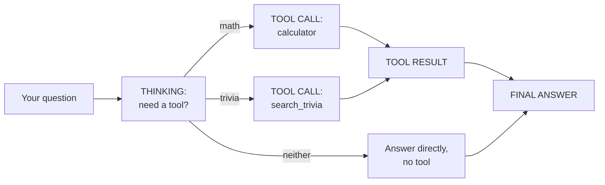

# 3. Agent Trace CLI

> 🌐 **No terminal? Try this demo in your browser — nothing to install:**
> https://khadir-syed.github.io/k_ai-basics/web/03/

## What is this?

Imagine you ask a friend a question. Before answering, your friend thinks
for a second: "Do I know this off the top of my head, or do I need to grab
a calculator, or look something up?" Then they do that thing, and *then*
they answer you.

That little pause — "what do I need to do first?" — is what people mean
when they call an AI an **agent**. It's not just answering, it's deciding
*how* to answer, sometimes using a tool along the way.

This demo shows every one of those steps printed out loud in your
terminal: what the agent is thinking, which tool (if any) it picks, what
the tool gave back, and the final answer.

## How it works, in a picture



## What you need

- Python installed on your computer.
- Nothing else, by default. No password, no account, no credit card, no
  packages to install — this demo only uses tools already built into
  Python.

## How to run it, step by step

**1. Open your terminal and walk into this folder:**

```bash
cd 03-agent-trace
```

**2. Ask it something math-shaped:**

```bash
python trace.py "what is 12 times 4"
```

**3. Ask it a trivia question:**

```bash
python trace.py "what is the fastest land animal"
```

**4. Ask it something neither tool can help with:**

```bash
python trace.py "tell me a joke"
```

**5. Watch the trace each time.** You'll see:
- `[THINKING]` — the agent deciding what to do
- `[TOOL CALL]` — which tool it picked, and what it sent it (only shown
  when a tool was actually used)
- `[TOOL RESULT]` — what the tool handed back
- `[FINAL ANSWER]` — what the agent tells you

> 📅 **Example output, as of 23 September 2026.** This is a real run, copied
> here so you can see what to expect. If the demo changes later, your output
> may look a little different — that's okay.

```
$ python trace.py "what is 12 times 4"
📄 Rule-based mode — a regex decides which tool to use:

[THINKING] Checking whether this needs a tool...
[TOOL CALL] calculator("12 * 4")
[TOOL RESULT] 48
[FINAL ANSWER] 12 * 4 = 48

$ python trace.py "tell me a joke"
📄 Rule-based mode — a regex decides which tool to use:

[THINKING] Checking whether this needs a tool...
[THINKING] No tool matches — not math, not one of my trivia topics.
[FINAL ANSWER] I can only do math (e.g. "12 * 4") or answer a handful of trivia questions. Try one of those!
```

**What am I looking at?** In the first one, the agent saw numbers and the
word "times", so it grabbed its calculator, typed in `12 * 4`, got `48`
back, and told you. In the second one, it looked at its toolbox, saw
nothing that tells jokes, and said so honestly — no tool, no pretending.

## How the agent decides, by default

Out of the box, this demo uses a simple **rule**, not real thinking: if
your question has numbers and a math word/symbol in it, it calls the
calculator. If it matches one of 6 built-in trivia facts (planets, animals,
mountains, inventions...), it calls the trivia lookup. Otherwise, it just
answers directly — showing you that a real agent should know when a tool
*doesn't* apply, too.

If you give the calculator something it can't do — like dividing by zero —
it doesn't break. It says "I couldn't work that out" and tells you why,
just like a friend saying "hmm, that sum doesn't make sense."

## Optional: let a real AI model decide, with an API key

By default the tool-picking is just a rule, not real reasoning. With an API
key, this demo instead sends your question to a real AI model and lets
*it* decide which tool to use (or none), exactly the way production AI
agents work:

```bash
export ANTHROPIC_API_KEY="your-key-here"
python trace.py "what is 12 times 4" --key
```

`OPENAI_API_KEY` also works if you don't have an Anthropic key (Anthropic
is used first if both are set). Without `--key`, this demo **never** makes
an internet call and **never** needs a key at all.

**Which AI model does it use?** Right now it uses `claude-haiku-4-5`
(Anthropic) or `gpt-4o-mini` (OpenAI) — small, fast, cheap models. AI
companies bring out new models all the time, like new versions of a toy. If
you want to try a newer one, open [`trace.py`](trace.py), find the two lines
near the top that start with `ANTHROPIC_MODEL` and `OPENAI_MODEL`, and put
the new model's name between the quotes.

## Where this leads

This demo hardcodes 2 tools and a tiny rulebook so you can see every
moving part. Real AI agents chain together many tools, remember earlier
steps, and can recover when a tool fails — that's what the full
orchestration layer in the tech-version `k_` repos builds on top of this
same idea. Links to those: **https://khadir-syed.github.io/**
