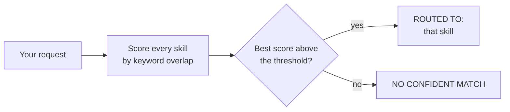

# 4. Router Playground

## What is this?

Imagine you walk into a help desk and say "my login is broken." Before
anyone can help you, someone first has to decide *which* desk you actually
need — tech support, not billing, not lost-and-found.

That decision — matching a request to the right specialist — is what this
demo shows, one step at a time, printed out loud in your terminal.

> **This is a simplified version of the `request-router-agent` in
> [`k_ai-agent-skills`](https://github.com/khadir-syed/k_ai-agent-skills)** —
> see `request-router-agent-controlled` / `request-router-agent-autonomous`
> there. That version routes real work to real agents with human
> checkpoints; this one only shows the decision-making step in isolation,
> with nothing downstream.

## How it works, in a picture



## What you need

- Python installed on your computer.
- Nothing else, by default. No password, no account, no credit card, no
  packages to install — this demo only uses tools already built into
  Python.

## How to run it, step by step

**1. Open your terminal and walk into this folder:**

```bash
cd 04-router-playground
```

**2. Ask something that clearly matches one skill:**

```bash
python router.py "fix the bug where login fails silently"
```

**3. Ask something that clearly matches a different skill:**

```bash
python router.py "write a blog post about our new feature"
```

**4. Ask something that matches nothing:**

```bash
python router.py "what's the weather today"
```

**5. Watch the trace each time.** You'll see:
- `[REQUEST]` — the request you typed
- `[CHECKING]` — every skill, scored, with which keywords matched
- `[ROUTED TO]` / `[WHY]` — the winner and why, or `[NO CONFIDENT MATCH]`
  if nothing scored high enough

> 📅 **Example output, as of 23 September 2026.** This is a real run, copied
> here so you can see what to expect. If the demo changes later, your output
> may look a little different — that's okay.

```
[REQUEST]  "fix the bug where login fails silently"
[CHECKING] bug-fixer             -> score: 0.43  (matched: bug, fails, fix)
[CHECKING] writer                -> score: 0.00
[CHECKING] release-notes-helper  -> score: 0.00
[ROUTED TO] bug-fixer
[WHY] Highest keyword overlap with this skill's trigger terms.
📋 Rule-based

[REQUEST]  "what's the weather today"
[CHECKING] bug-fixer             -> score: 0.00
[CHECKING] writer                -> score: 0.00
[CHECKING] release-notes-helper  -> score: 0.00
[NO CONFIDENT MATCH] No skill scored above the threshold (0.2) — a real router would ask a human instead of guessing.
```

**What am I looking at?** For the first request, the router checked all 3
helpers. `bug-fixer` found 3 of its magic words ("bug", "fails", "fix"),
the others found none — so `bug-fixer` gets the job. For the weather
question, *nobody* found a magic word, so instead of picking someone at
random, it says "I'm not sure — let's ask a person."

## The 3 mock skills

| Skill | Description | Trigger keywords |
|---|---|---|
| `bug-fixer` | Diagnoses and fixes broken or crashing code. | bug, error, crash, broken, fails, exception, fix |
| `writer` | Drafts blog posts, articles, and other written content. | draft, write, blog, article, post, copy, essay, content |
| `release-notes-helper` | Writes changelog entries for a new release. | changelog, release, version, notes, ship, deploy, update |

## How the router decides, by default

Out of the box, this demo uses a simple **rule**, not real thinking: for
each skill, `score = (that skill's keywords found in your request) ÷ (total
keywords for that skill)`. Open [`router.py`](router.py) — the whole
scoring function is about ten lines. Whichever skill scores highest wins,
*unless* the best score is below `0.2` — then the demo refuses to guess and
prints `[NO CONFIDENT MATCH]` instead, because forcing a wrong guess is
worse than saying "I'm not sure."

## Optional: let a real AI model decide, with an API key

By default the routing is just a rule, not real reasoning. With an API key,
this demo instead sends your request and the 3 skill descriptions to a real
AI model and lets *it* decide which skill fits (or none):

```bash
export ANTHROPIC_API_KEY="your-key-here"
python router.py --key "fix the bug where login fails silently"
```

`OPENAI_API_KEY` also works if you don't have an Anthropic key (Anthropic is
used first if both are set). The output stays the same shape (`[ROUTED TO]`
/ `[WHY]`) so you can directly compare the rule-based decision against the
LLM's decision on the same input. Without `--key`, this demo **never** makes
an internet call and **never** needs a key at all.

**Which AI model does it use?** Right now it uses `claude-haiku-4-5`
(Anthropic) or `gpt-4o-mini` (OpenAI) — small, fast, cheap models. AI
companies bring out new models all the time, like new versions of a toy. If
you want to try a newer one, open [`llm.py`](llm.py), find the two lines
near the top that start with `ANTHROPIC_MODEL` and `OPENAI_MODEL`, and put
the new model's name between the quotes.

**What's `llm.py`?** It's the little messenger that carries your question to
the AI company's computer and brings the answer back. It's only used when
you add `--key` — without `--key`, it just sits there doing nothing. The
same messenger file lives in every demo that has a `--key` mode, so each
folder still works on its own.

## Self-check

```bash
python test_router.py
```

## Where this leads

This demo only shows the *decision*, not what happens after — for a
downstream action following a decision, see
[`03-agent-trace`](../03-agent-trace/) in this repo. For routing with real
human approval checkpoints across real agents, see
[`request-router-agent-controlled`](https://github.com/khadir-syed/k_ai-agent-skills)
and its autonomous counterpart in `k_ai-agent-skills`. Links to the full
tech-version `k-` repos: **https://khadir-syed.github.io/**
