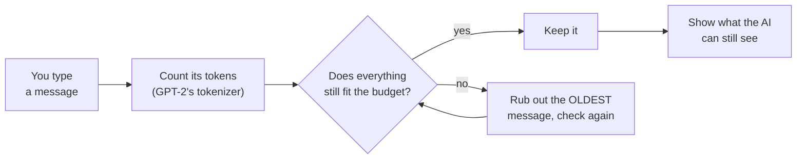

# 5. Context Window Explorer

> 🌐 **No terminal? Try this demo in your browser — nothing to install:**
> https://khadir-syed.github.io/k_ai-basics/web/05/

## What is this?

Imagine you're telling a friend a long story, but your friend has a tiny
notepad that only fits a few lines. Every time the notepad is full and you
say something new, your friend has to rub out the **oldest** line to make
room. Later, if you ask "what did I say at the start?" — it's gone. Your
friend didn't *choose* to forget. The notepad was just full.

AI chatbots work the same way. They can only "see" a certain number of
**tokens** at once (remember tokens from Demo 01 — the little Lego bricks
words are cut into?). That limit is called the **context window**. When a
chat gets too long, the oldest messages fall off the notepad.

This demo gives the AI a tiny notepad on purpose, so you can watch it fill
up and see *exactly* which message gets rubbed out.

## How it works, in a picture



## What you need

- Python installed on your computer.
- Nothing else to sign up for. No password, no account, no credit card.

## How to run it, step by step

**1. Open your terminal and walk into this folder:**

```bash
cd 05-context-window
```

**2. Make a clean little box for this demo's tools:**

```bash
python3 -m venv .venv
source .venv/bin/activate
```

**3. Give it its tools:**

```bash
pip install -r requirements.txt
```

**4. Start chatting:**

```bash
python explore.py
```

It starts with a small notepad of **30 tokens** (that's the default) — about
3 short sentences. That's tiny on purpose, so you can see forgetting happen
quickly. Step 6 shows how to make it bigger.

The very first time only, it downloads GPT-2's **tokenizer** — the part of
GPT-2 that cuts words into tokens. It's tiny (a few MB) and quick. It does
*not* download the big GPT-2 "brain" from Demo 01, because counting tokens
doesn't need it.

**5. Type messages, one per line, and press Enter after each.** Try telling
it a little story about something, then ask about the very first thing you
said. Type `quit` when you're done.

**6. Want a bigger or smaller notepad?** The default budget is 30 tokens.
Add `--budget` and any number you like. For example, this gives it room for
100 tokens, so you can paste longer messages:

```bash
python explore.py --budget 100
```

**7. Close the box when you're done:**

```bash
deactivate
```

> 📅 **Example output, as of 23 September 2026.** This is a real run, copied
> here so you can see what to expect. If the demo changes later, your output
> may look a little different — that's okay.

```
[BUDGET]   30 tokens — the AI can only "see" this many tokens at once.
           (That's the default. Want a bigger notepad? Restart with: python explore.py --budget 100)
Type a message and press Enter. Type 'quit' when you're done.

you> Hi, I ordered a blue jacket last week
[ADD]      "Hi, I ordered a blue jacket last week" (+9 tokens)
[CURRENT]  9/30 tokens [######..............] — 1 message(s) remembered

...  (2 more messages)

you> Also, my order number is 48213
[ADD]      "Also, my order number is 48213" (+8 tokens)
[OVER BUDGET] Dropping the oldest message to make room:
   ✗ REMOVED: "Hi, I ordered a blue jacket last week" (9 tokens)
[CURRENT]  25/30 tokens [#################...] — 3 message(s) remembered

you> What was the colour of my jacket again?
[ADD]      "What was the colour of my jacket again?" (+9 tokens)
[OVER BUDGET] Dropping the oldest message to make room:
   ✗ REMOVED: "It arrived today but the zip is broken" (8 tokens)
[CURRENT]  26/30 tokens [#################...] — 3 message(s) remembered

you> quit

[SUMMARY]  You sent 5 message(s). The AI forgot 2 of them (always the oldest ones first).
[STILL REMEMBERS]
   1. "Can I get a replacement or a refund?" (9 tokens)
   2. "Also, my order number is 48213" (8 tokens)
   3. "What was the colour of my jacket again?" (9 tokens)
[TAKEAWAY] This is why long chats can lose track of something you said early on.
```

**What am I looking at?** Each message gets counted in tokens, and the bar
shows how full the notepad is. When the order number came in, the notepad
overflowed — so the very first message, *"I ordered a blue jacket"*, got
rubbed out. Then you asked "what colour was my jacket?" — but the word
"blue" isn't on the notepad anymore! The AI would have to guess. That's the
whole lesson: it's not being forgetful on purpose, it simply ran out of
room.

## What if one message is too big?

If you type one single message that's bigger than the whole budget, it
can't fit on the notepad even if everything else is rubbed out. The demo
tells you `[TOO BIG]`, skips it, and keeps your earlier messages safe. It
also tells you what `--budget` to restart with so a message that long can
fit. (Real chatbots have much bigger notepads — often hundreds of
thousands of tokens — but the rule is the same.)

## No API key needed

This demo never asks you for a key, a password, or an account. It only
*counts* tokens — it doesn't need an AI to write anything — so there's no
`--key` mode at all. Everything happens on your own computer.

## Self-check

```bash
python test_explore.py
```
