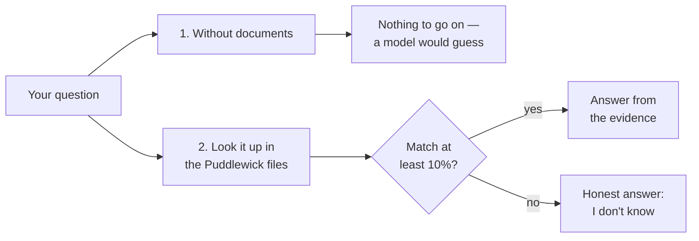

# 6. Hallucination Demo

> 🌐 **No terminal? Try this demo in your browser — nothing to install:**
> https://khadir-syed.github.io/k_ai-basics/web/06/

## What is this?

Imagine two kids are asked: *"What's the name of the mayor's cat in
Puddlewick?"*

- The first kid has **no book**. They've never heard of Puddlewick, but they
  don't want to look silly, so they say *"Whiskers!"* — loudly, with a big
  smile. It sounds sure. It's a guess.
- The second kid has **the town's guidebook**. They flip to the right page
  and read out: *"Sir Pickles."* That's not a guess — it's written down.

When an AI makes something up and says it confidently, people call it a
**hallucination**. This demo asks the same question both ways — once with
no documents, once after looking things up first (the "RAG" idea from Demo
02) — so you can see the difference side by side.

The town, **Puddlewick**, is completely made up. It lives only in the
three little files in [`docs/`](docs/). That's on purpose: no AI could have
learned about it anywhere else, so without the documents it *can't* know.

## How it works, in a picture



## What you need

- Python installed on your computer.
- Nothing else to sign up for, by default. No password, no account, no
  credit card.

## How to run it, step by step

**1. Open your terminal and walk into this folder:**

```bash
cd 06-hallucination-demo
```

**2. Make a clean little box for this demo's tools:**

```bash
python3 -m venv .venv
source .venv/bin/activate
```

**3. Give it its tools:**

```bash
pip install -r requirements.txt
```

**4. Ask it something about Puddlewick:**

```bash
python compare.py "What is the name of the mayor's cat in Puddlewick?"
```

**5. Close the box when you're done:**

```bash
deactivate
```

> 📅 **Example output, as of 23 September 2026.** This is a real run, copied
> here so you can see what to expect. If the demo changes later, your output
> may look a little different — that's okay.

```
[QUESTION] "What is the name of the mayor's cat in Puddlewick?"

── 1. WITHOUT DOCUMENTS ──────────────────────────────────────
🤷 Nothing to look at. A model with no documents has never read about
   this, so it would have to guess here — and a guess can sound just
   as sure as a fact.
📄 Illustrative — no AI was asked. Add --key to ask a real one.

── 2. WITH DOCUMENTS (look it up first) ──────────────────────
Best-matching paragraphs:
   puddlewick_town.txt        ##########            47.8%  ✓
   puddlewick_town.txt        #######               37.3%  ✓
   puddlewick_festival.txt    #                      7.0%  ✗ too weak

📚 Best evidence, from puddlewick_town.txt (47.8% match):

   The mayor's cat is a ginger cat called Sir Pickles, who sleeps on the
   town hall steps. Sir Pickles is the town's official "Chief Welcomer",
   and visitors are asked to say hello to the cat before anyone else.

   A model would answer from this. Word matching isn't perfect,
   so check it really answers your question!
```

**What am I looking at?** Side 1 has nothing to read, so all it could do is
guess. Side 2 looked through the Puddlewick files first, scored every
paragraph, and found the one about Sir Pickles. The `✓` means "matched well
enough to trust" (10% or more); `✗ too weak` means "only a word or two in
common — not real evidence."

## Try these questions

These have answers in the documents — but only there:

```bash
python compare.py "What year was the Puddlewick lighthouse built?"
```

```bash
python compare.py "Who won the Golden Welly last year?"
```

This one is *not* in the documents at all — watch side 2 say "I don't know":

```bash
python compare.py "What are the tax rules for crypto?"
```

And this is a sneaky one. The documents talk about the lighthouse, but they
never say how **tall** it is:

```bash
python compare.py "How tall is the lighthouse?"
```

Side 2 shows the lighthouse paragraph as its best evidence — but read it:
there's no height in it! Word matching found the right *topic*, not the
right *answer*. That's why a good AI is told to say "I don't know" when the
evidence doesn't really answer the question.

## Best with an API key: ask a real AI both ways

Without a key, side 1 only *describes* what a model would do. This demo is
the one that gains the most from a key: with `--key`, it asks a **real** AI
model the same question twice — once with nothing, once with the matching
Puddlewick paragraphs — and prints both real answers.

```bash
export ANTHROPIC_API_KEY="your-key-here"
python compare.py "What is the name of the mayor's cat in Puddlewick?" --key
```

`OPENAI_API_KEY` also works (Anthropic is used first if both are set).

**What each side is told.** Both sides get the same instruction: *"Answer
in 2-3 sentences."* Side 2 also gets the matching Puddlewick paragraphs, and
is told to use only those and to say "I don't know" if they don't have the
answer. The documents are the only thing side 1 is missing.

**What you might see — and both are good lessons:**

- **The model makes something up** — a name, a year, a whole history — and
  says it confidently. That's a hallucination, caught in the act.
- **The model says "I don't know Puddlewick."** That's the *good*
  behaviour! Newer models are better at admitting when they don't know.

**Questions most likely to tempt a guess** are ones that *sound* real — a
made-up town placed in a real county:

```bash
python compare.py "What was the name of the lighthouse keeper in Puddlewick, Cornwall?" --key
```

```bash
python compare.py "Who is the mayor of Puddlewick in Devon?" --key
```

> 📅 **What happened when we tried it, 23 September 2026.** We used two
> models, `gpt-oss-20b` and `gpt-oss-120b` (run by Groq, through a local
> OmniRoute gateway). Your results will be different — models change, and
> the same model can answer differently each time.

| Question | Side 1: no documents | Side 2: with documents |
|---|---|---|
| Lighthouse keeper in Puddlewick, Cornwall (20b) | "Thomas H. Evans, who served from the beacon's opening in 1839 until his retirement in 1865" — **made up** | Mr. Oswin Fairweather ✅ |
| Lighthouse keeper in Puddlewick, Cornwall (120b) | "Thomas Penrose… the central figure in the local legend" — **made up** | Mr. Oswin Fairweather ✅ |
| Mayor of Puddlewick in Devon (120b) | "a small hamlet in Devon… local affairs are handled by the parish council" — **made up** | Hazel Brambleton ✅ |
| Mayor's cat in Puddlewick (20b) | "I don't know the name of the mayor's cat" — honest ✅ | Sir Pickles ✅ |

**What am I looking at?** Puddlewick doesn't exist, so every name and date
on side 1 was invented — but each one *sounds* completely sure. Look at the
first two rows: two models gave **two different names** for the same
lighthouse keeper. When answers disagree like that, at least one of them
is a guess. Side 2, with the documents, got the right answer every time.
And when we asked about the town on its own, without a real county, the
model said "I don't know" — the good behaviour.

**One more thing to try: a real-world question.**

```bash
python compare.py "What are the tax rules for crypto?" --key
```

Side 1 answers from everything the model learned before — a real topic, so
it has plenty to say (but it can still slip in made-up details, and you
can't easily tell which bits). Side 2 says "I don't know", because the
Puddlewick files say nothing about taxes. That's the other half of the
lesson: looking things up keeps an AI honest, but it can only know what's
in its documents.

If an answer ever comes back as "(The model sent back no words…)", the
model spent all its room thinking. Just run it again, or try another model.

Without `--key`, this demo **never** makes an internet call and **never**
needs a key at all.

**Which AI model does it use?** Right now it uses `claude-haiku-4-5`
(Anthropic) or `gpt-4o-mini` (OpenAI). If you want to try a newer one, open
[`llm.py`](llm.py), find the two lines near the top that start with
`ANTHROPIC_MODEL` and `OPENAI_MODEL`, and put the new model's name between
the quotes.

**What's `llm.py`?** It's the little messenger that carries your question to
the AI company's computer and brings the answer back. It's only used when
you add `--key`. The same messenger file lives in every demo that has a
`--key` mode, so each folder still works on its own. It can also talk to
other AI services — see "Using a different AI service" in
[Demo 02's README](../02-mini-rag/README.md).

## Self-check

```bash
python test_compare.py
```
