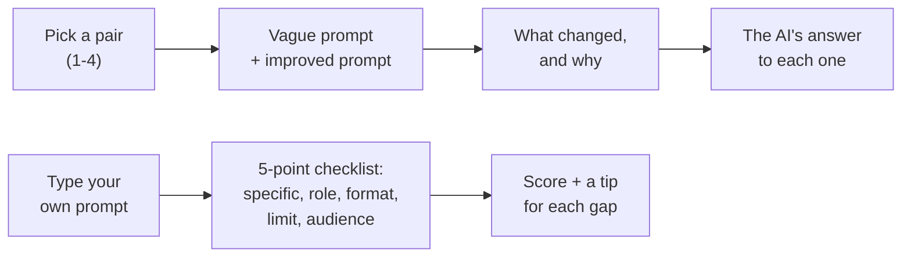

# 7. Prompt Engineering Playground

## What is this?

Imagine you ask a friend: *"Get me a snack."* They come back with a whole
bag of crisps, three biscuits and a banana. Not wrong — just not what you
wanted.

Now imagine you say: *"Get me one green apple from the fruit bowl, cut
into four slices, please."* This time you get exactly that.

Your friend didn't get smarter. **You** got clearer.

Talking to an AI works the same way. The message you type is called a
**prompt**, and small changes to it — saying *how long*, *what shape*, *who
it's for* — change the answer a lot. Getting good at this is called
**prompt engineering**. It's a real skill, not luck.

This demo shows you 4 pairs of prompts — one vague, one improved — with the
real answers a real AI gave to each. It can also check *your* prompt
against a simple checklist.

## How it works, in a picture



## What you need

- Python installed on your computer.
- Nothing else, by default. No password, no account, no credit card, no
  packages to install — this demo only uses tools already built into
  Python.

## How to run it, step by step

**1. Open your terminal and walk into this folder:**

```bash
cd 07-prompt-playground
```

**2. Start the menu:**

```bash
python playground.py
```

You'll see:

```
Pick a pair to compare, or check your own prompt:

  1. Too vague            "Write about dogs"
  2. No format            "Tell me about exercise"
  3. No limits            "Write an email asking for a day off"
  4. No role or audience  "Explain taxes"
  5. Check my own prompt
  q. Quit
```

**3. Type a number and press Enter.** Try `1` first. When you're done, type
`q` to quit.

**Shortcuts.** You can also jump straight to one thing without the menu:

```bash
python playground.py --pair 1
```

```bash
python playground.py --check "Write about dogs"
```

> 📅 **Example output, as of 23 September 2026.** This is a real run, copied
> here so you can see what to expect. If the demo changes later, your output
> may look a little different — that's okay.

```
══ Pair 1: Too vague ══

VAGUE PROMPT:    "Write about dogs"
IMPROVED PROMPT: "Write a 3-sentence, upbeat product description for a dog leash, aimed at first-time dog owners."

What changed, and why it helps:
  + Specific: a dog leash, not "dogs" in general
  + Format: a product description
  + Limit: 3 sentences, so it can't ramble
  + Audience: first-time dog owners, so it picks the right words

Checklist score: vague 0/5 → improved 4/5

── Answer to the VAGUE prompt ── 📄 Saved real answer from groq/openai/gpt-oss-120b, 23 September 2026

## Dogs: Man’s Best Friend, Companion, and Partner

### Overview
Dogs (*Canis lupus familiaris*) are domesticated descendants of the gray
wolf, selectively bred over thousands of years to fulfill a wide range of
roles—from hunting and herding to guarding, therapy, and simply providing
companionship. Today, there are hundreds of recognized breeds, each with its
own temperament, physical traits, and care requirements. Their close bond
with humans is built on mutual communication, shared environments, and a
remarkable ability to read human cues.

---
(… trimmed for space: 127 more lines)

── Answer to the IMPROVED prompt ── 📄 Saved real answer from groq/openai/gpt-oss-120b, 23 September 2026

Meet the BrightPup Adjustable Leash—designed with first‑time owners in mind,
it features a comfy, padded grip and a smooth‑glide, tangle‑free cord that
makes every walk a breeze. The vibrant, reflective colors keep you both
visible and stylish, while the sturdy, quick‑release clasp ensures safety
and confidence for you and your new best friend. Ready, set, explore—this
leash turns every stroll into a fun, worry‑free adventure!
```

**What am I looking at?** "Write about dogs" gave the AI nothing to go on,
so it wrote *everything* — a history, tables, breeds, care tips… 139 lines
before we cut it off. The improved prompt said *what* (a leash), *what
shape* (a product description), *how long* (3 sentences) and *who for*
(first-time owners) — and the AI did exactly that, in 6 lines.

## About the example answers

- **They're real.** Without a key, the demo shows answers that a real AI
  model (`gpt-oss-120b`, run by Groq through a local OmniRoute gateway)
  gave on **23 September 2026**. They're saved in
  [`saved_answers.json`](saved_answers.json), so the demo works offline.
  Ask again today and the words will be different — but the pattern (vague
  = long and unfocused, improved = short and on target) usually holds.
- **Long answers are cut to 12 lines on screen.** Some answers are over a
  hundred lines long, so the demo shows only the first 12 and then tells
  you how many lines it hid: `(… trimmed for space: 127 more lines)`.
  Nothing is hidden from you — the full answers are in `saved_answers.json`.
- **The longest answers were cut short by the AI service too.** Each answer
  was allowed up to 1,500 tokens. The three longest vague answers (dogs,
  exercise, taxes) hit that limit and stop mid-sentence. That's only visible
  if you open `saved_answers.json`.

## Check your own prompt

Pick `5` in the menu, or use the shortcut:

```bash
python playground.py --check "Give me 3 tips for new runners"
```

> 📅 Example output, as of 23 September 2026.

```
[YOUR PROMPT] "Give me 3 tips for new runners"

Checklist score: 2/5  [####......]
  ✗ Specific  tip: say exactly what you want, with details (10+ words)
  ✗ Role      tip: say who should answer, e.g. "You are a friendly vet..."
  ✗ Format    tip: say the shape, e.g. "3 bullet points" or "a short email"
  ✓ Limit
  ✓ Audience

Score 2/5 — missing: specific, role, format
(A checklist score, not a quality grade: it only spots the ingredients.)
```

**What am I looking at?** The checklist looks for 5 ingredients of a clear
prompt:

| Ingredient | What it means | Example |
|---|---|---|
| **Specific** | Enough detail about what you want (10+ words) | "…easy ways a busy office worker can exercise at home" |
| **Role** | Who the AI should act as | "You are a friendly teacher." |
| **Format** | What shape the answer should be | "3 bullet points", "a short email" |
| **Limit** | How long it should be | "under 80 words", "in 4 sentences" |
| **Audience** | Who the answer is for | "for a 10-year-old", "for my manager" |

For every missing ingredient you get a tip, and a list of what's missing.

**Important: the score is a checklist, not a grade.** It only spots whether
certain *words* are there — it can't tell if your prompt makes sense. For
example, *"You are a list of 5 words for kids"* is nonsense, but it scores
4/5 because it contains the right kinds of words. Use the score as a
reminder of what to think about, not as a mark out of 5. (And not every
prompt needs all 5 — a quick question doesn't need a role!)

## Optional: ask a real AI right now, with an API key

Without a key, you see the saved answers from 23 September 2026. With
`--key`, the demo sends **both** prompts of a pair to a real AI model right
now and shows you the two fresh answers:

```bash
export ANTHROPIC_API_KEY="your-key-here"
python playground.py --pair 4 --key
```

`OPENAI_API_KEY` also works (Anthropic is used first if both are set). The
12-line trim applies here too. The checklist never needs a key — it just
reads your words. Without `--key`, this demo **never** makes an internet
call and **never** needs a key at all.

**Which AI model does it use?** Right now it uses `claude-haiku-4-5`
(Anthropic) or `gpt-4o-mini` (OpenAI). If you want to try a newer one, open
[`llm.py`](llm.py), find the two lines near the top that start with
`ANTHROPIC_MODEL` and `OPENAI_MODEL`, and put the new model's name between
the quotes.

**What's `llm.py`?** It's the little messenger that carries your prompt to
the AI company's computer and brings the answer back. It's only used when
you add `--key`. The same messenger file lives in every demo that has a
`--key` mode, so each folder still works on its own. It can also talk to
other AI services — see "Using a different AI service" in
[Demo 02's README](../02-mini-rag/README.md).

## For maintainers: refreshing the saved answers

To replace the saved answers with fresh ones from whichever model you have
set up:

```bash
python playground.py --save-examples
```

It asks all 4 pairs (8 questions) and overwrites `saved_answers.json` with
the answers, the model's name and today's date. It saves answers only —
never your key. Update the dates in this README afterwards.

## Self-check

```bash
python test_playground.py
```
