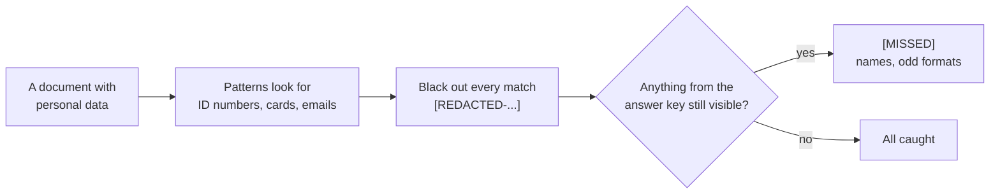

# 9. PII Redaction Demo

> ⚠️ **This is a simplified teaching example, not a production security
> tool. Real systems need defense in depth, not a single regex filter.**

> 🌐 **No terminal? Try this demo in your browser — nothing to install:**
> https://khadir-syed.github.io/k_ai-basics/web/09/

## What is this?

Imagine you want a friend to help you with a letter from your bank. Before
you hand it over, you take a thick black marker and cross out your account
number, your email and anything else private. Your friend can still help —
they just can't see the secret bits.

AI works the same way. Documents people paste into an AI often contain
**personal data** — names, ID numbers, card numbers, emails. The grown-up
word for it is **PII** (personally identifiable information). If it goes in,
the AI might repeat it back, store it, or show it to the wrong person. So
before a document goes to an AI, a program can **redact** it: find the
private bits and black them out.

This demo does that with simple **patterns** (called regexes) — one for
ID numbers, one for card numbers, one for emails. Then it checks its own
work against a hand-written list of everything private in the documents, so
you can see exactly what the marker **missed**.

All the personal data here is **made up**. The ID numbers start with `000`
(real US social security numbers never do), the card numbers are the
standard test numbers used by payment companies, and every email ends in
`example.com`, a name reserved for examples.

## How it works, in a picture



## What you need

- Python installed on your computer.
- Nothing else. No password, no account, no credit card, no API key, no
  packages to install — this demo only uses tools already built into
  Python, and it never goes on the internet.

## How to run it, step by step

**1. Open your terminal and walk into this folder:**

```bash
cd 09-pii-redaction
```

**2. Run it:**

```bash
python redact.py
```

> 📅 **Example output, as of 24 September 2026.** This is a real run, copied
> here so you can see what to expect. If the demo changes later, your output
> may look a little different — that's okay.

```
── 1_support_ticket.txt ────────────────────────────────────────
[UNREDACTED] "Customer John Smith, SSN 000-12-3456, reports a billing issue: he was charged twice for the same order. Card on file is 4111 1111 1111 1111. Please reply to john.smith@example.com once the refund is done."
[SCANNING]   Regex patterns matched: CARD (1), SSN (1), EMAIL (1)
[REDACTED]   "Customer John Smith, SSN [REDACTED-SSN], reports a billing issue: he was charged twice for the same order. Card on file is [REDACTED-CARD]. Please reply to [REDACTED-EMAIL] once the refund is done."
[MISSED]     NAME "John Smith" — a regex can't tell a name from any other word.

── 2_order_note.txt ────────────────────────────────────────────
[UNREDACTED] "Jane Doe asked us to switch her payment card to 5555-5555-5555-4444 and send the receipt to jane.doe@example.com. She also mentioned that her colleague Sam Taylor will collect the parcel on Friday."
[SCANNING]   Regex patterns matched: CARD (1), EMAIL (1)
[REDACTED]   "Jane Doe asked us to switch her payment card to [REDACTED-CARD] and send the receipt to [REDACTED-EMAIL]. She also mentioned that her colleague Sam Taylor will collect the parcel on Friday."
[MISSED]     NAME "Jane Doe" — a regex can't tell a name from any other word.
[MISSED]     NAME "Sam Taylor" — a regex can't tell a name from any other word.

── 3_chat_log.txt ──────────────────────────────────────────────
[UNREDACTED] "Sam Taylor: Hi, I can't log in. My social is 000 45 6789 if you need it. Sam Taylor: You can email me at sam dot taylor at example dot com. Agent: Thanks, I've sent a reset link."
[SCANNING]   Regex patterns matched: none
[REDACTED]   "Sam Taylor: Hi, I can't log in. My social is 000 45 6789 if you need it. Sam Taylor: You can email me at sam dot taylor at example dot com. Agent: Thanks, I've sent a reset link."
[MISSED]     NAME "Sam Taylor" — a regex can't tell a name from any other word.
[MISSED]     SSN "000 45 6789" — written in a format the pattern doesn't expect.
[MISSED]     EMAIL "sam dot taylor at example dot com" — written in a format the pattern doesn't expect.

── SUMMARY ─────────────────────────────────────────────────────
[CAUGHT]     5 of 11 pieces of personal data. Pattern matches: CARD 2, SSN 1, EMAIL 2.
[MISSED]     6 (NAME 4, SSN 1, EMAIL 1).
[LESSON]     Simple patterns catch the tidy cases. Names and oddly written
             data slip through — redaction isn't solved by one regex pass.
```

**What am I looking at?**

- `[UNREDACTED]` is the document as it arrived.
- `[SCANNING]` says which patterns found something.
- `[REDACTED]` is what would be sent to the AI — every match replaced with
  a label like `[REDACTED-CARD]`.
- `[MISSED]` is private data that is **still there** after redacting. The
  demo knows because it compares against a hand-written list of every piece
  of personal data in the documents:
  [`docs/answer_key.json`](docs/answer_key.json). Checking a tool against a
  known answer list like this is how real redaction tools are tested too.

The tidy cases are all caught: `000-12-3456`, both card numbers, both
normal emails. But look at what got through:

- **Names.** "John Smith" looks just like any other two words to a pattern.
  There is no rule that says "this is a name".
- **Odd formats.** `000 45 6789` uses spaces instead of dashes, and
  `sam dot taylor at example dot com` is an email spelled out in words. A
  person reads them easily; the patterns don't match them at all.

That's the lesson: **5 out of 11** is not safe. Real systems add more
layers — smarter name-spotting tools, rules about what can be pasted in the
first place, and people checking.

## Why no `--key` mode?

The other demos can ask a real AI with `--key`. This one doesn't, on
purpose: redaction is about **finding and blacking out** data *before* the
AI sees it, not about getting the AI to write something. Keeping it fully
offline also means no personal data — even made-up data — ever leaves your
computer.

## Try it yourself

Open any file in [`docs/`](docs/) and add your own **made-up** line, for
example `Call me on 000-99-8888`, then run `python redact.py` again. Look at
the `[REDACTED]` line: was your number blacked out? Now write the same
number a different way — with dots, or in words — and see if it slips
through.

> ⚠️ **Only ever use made-up details.** Never type your own real name,
> number, card or email into these files.

Your new line won't appear in the `[MISSED]` list — that list only knows
about the personal data that was already in the documents.

## Self-check

```bash
python test_redact.py
```
