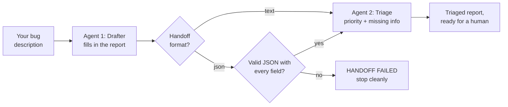

# 10. Multi-Agent Handoff

> 🌐 **No terminal? Try this demo in your browser — nothing to install:**
> https://khadir-syed.github.io/k_ai-basics/web/10/

## What is this?

Think about visiting a doctor's office. You don't see one person who does
everything. First, the **receptionist** listens to you and fills in a form:
your name, what's wrong, when it started. Then they hand the form to the
**nurse**, who reads it and decides how urgent you are — and asks you
anything the form is missing.

Two people, two jobs, one piece of paper passed between them.

Real AI systems often work the same way. Instead of one AI doing
everything, there are several **agents**, each with one job, passing work
along. That's what people mean by **multi-agent**. In this demo:

- **Agent 1, the Drafter**, turns your messy description of a bug into a
  tidy bug report.
- **Agent 2, the Triage agent**, reads that report, decides how urgent it
  is (HIGH, MEDIUM or LOW) and flags what information is missing.

The moment the report passes from one agent to the other is called the
**handoff** — and, just like a form that gets lost or filled in wrong, it's
where things can go wrong.

> This is a simplified two-agent version of the multi-agent orchestration in
> [`k_ai-agent-skills`](https://github.com/khadir-syed/k_ai-agent-skills). Go
> there next to see it with real tool access, more agents, and
> human-in-the-loop checkpoints.

## How it works, in a picture



## What you need

- Python installed on your computer.
- Nothing else, by default. No password, no account, no credit card, no
  packages to install — this demo only uses tools already built into
  Python.

## How to run it, step by step

**1. Open your terminal and walk into this folder:**

```bash
cd 10-multi-agent-handoff
```

**2. Describe a bug, in quotes:**

```bash
python handoff.py "the app crashes when I upload big files"
```

> 📅 **Example output, as of 24 September 2026.** This is a real run, copied
> here so you can see what to expect. If the demo changes later, your output
> may look a little different — that's okay.

```
📋 Rule-based — both agents follow simple, visible rules.
Handoff format: json

[AGENT 1: Drafter]  Received: "the app crashes when I upload big files"
[AGENT 1: Drafter]  Output →
                    {
                      "title": "The app crashes when I upload big files",
                      "description": "the app crashes when I upload big files",
                      "severity": "unknown",
                      "steps": "not provided",
                      "environment": "not provided"
                    }
[HANDOFF] Passing draft to Triage Agent as JSON...
[HANDOFF] Checked: valid JSON with all 5 fields ✓
[AGENT 2: Triage]   Reviewing draft...
[AGENT 2: Triage]   Priority: HIGH ("crash" reported)
[AGENT 2: Triage]   Missing info flagged: "steps to reproduce", "device / browser", "file size tested"
[FINAL OUTPUT] Structured, triaged bug report ready for a human.
```

**What am I looking at?**

- **The Drafter** received your words and filled in a form with 5 boxes:
  title, description, severity, steps, environment. It leaves severity as
  "unknown" on purpose — deciding urgency is the *other* agent's job.
- **The handoff** checked the form before passing it on: is it proper JSON
  (a strict, machine-readable format) and are all 5 boxes there? Yes — so
  it went through.
- **The Triage agent** read the form. It saw "crash", so it marked it
  **HIGH**. It also noticed three things the reporter didn't say: how to
  make it happen again, which device they used, and how big the file was.

Without a key, both agents are **simple rules**, not AI — you can read
them at the top of [`handoff.py`](handoff.py) (`PRIORITY_RULES`,
`ENVIRONMENT_WORDS`). Nothing is hidden.

## Two ways to hand over the work

The `--handoff` option picks how the Drafter passes its report along. Run
the same bug the other way:

```bash
python handoff.py "the app crashes when I upload big files" --handoff text
```

```
📋 Rule-based — both agents follow simple, visible rules.
Handoff format: text

[AGENT 1: Drafter]  Received: "the app crashes when I upload big files"
[AGENT 1: Drafter]  Output →
                    Title: The app crashes when I upload big files
                    Description: the app crashes when I upload big files
                    Severity: unknown
                    Steps: not provided
                    Environment: not provided
[HANDOFF] Passing draft to Triage Agent as plain text...
[HANDOFF] Nothing checks its shape — the Triage Agent reads it as-is.
[AGENT 2: Triage]   Reviewing draft...
[AGENT 2: Triage]   Priority: HIGH ("crash" reported)
[AGENT 2: Triage]   Missing info flagged: "steps to reproduce", "device / browser", "file size tested"
[FINAL OUTPUT] Structured, triaged bug report ready for a human.
```

Same answer, different handoff:

| | `--handoff json` (the default) | `--handoff text` |
|---|---|---|
| Like... | a printed form with labelled boxes | a handwritten note |
| Checked before passing on? | Yes — must be valid JSON with all 5 fields | No — passed on as-is |
| If the Drafter messes up | The handoff **stops**: `[HANDOFF FAILED]` | The Triage agent tries its best with whatever it gets |

Strict is safer, because a broken report never reaches the next agent.
Forgiving is easier, but mistakes can travel silently down the line. Real
multi-agent systems have to pick — often both, in different places.

## Try these

```bash
python handoff.py "Checkout is slow in Chrome. Steps: 1. add item 2. click pay"
```

MEDIUM priority ("slow"), and nothing is missing — the report says which
browser, and has steps.

```bash
python handoff.py "The settings button colour is slightly off on my iPhone"
```

LOW priority — no crash, error or slowness.

## Best with an API key: two real AI agents

This is the demo where a key makes the biggest difference. With `--key`,
**both agents become real AI model calls**, each with its own short job
description (you can read both in `drafter_prompt` and `triage_prompt` in
[`handoff.py`](handoff.py)). The Drafter writes a real report in its own
words, and the Triage agent reasons about it — no fixed keyword lists.

Start with the forgiving plain-text handoff:

```bash
export ANTHROPIC_API_KEY="your-key-here"
python handoff.py "the app crashes when I upload big files" --handoff text --key
```

`OPENAI_API_KEY` also works (Anthropic is used first if both are set).

Then try the strict one:

```bash
python handoff.py "the app crashes when I upload big files" --key
```

Now the Drafter must reply in JSON, and the code checks it before the
Triage agent sees it. Smaller models sometimes add chatty words around
their JSON or leave out a field. When that happens you'll see
`[HANDOFF FAILED]` and the demo stops — **that's not a bug in the demo**,
it's the lesson: this is exactly the kind of broken handoff real
multi-agent systems have to guard against. (The check does forgive one
common habit: wrapping the JSON in a ```` ```json ```` code block.)

> 📅 **What happened when we tried it, 24 September 2026.** Bug:
> *"the app crashes when I upload big files"*. We used `gpt-oss-20b` and
> `gpt-oss-120b` (run by Groq, through a local OmniRoute gateway). Your
> results will be different — models change, and the same model can answer
> differently each time.

| Model | Handoff | Drafter's title | Handoff check | Triage said |
|---|---|---|---|---|
| gpt-oss-20b | text | "App crashes on uploading large files" | (none — text) | HIGH, critical functionality broken. Missing: steps, environment |
| gpt-oss-20b | json | "App crash on uploading large files" | valid JSON, all 5 fields ✓ | HIGH, app crash on upload indicates critical failure. Missing: steps, environment, device, app version, OS version |
| gpt-oss-120b | json | "App crashes on uploading large files" | valid JSON, all 5 fields ✓ | HIGH, core upload crashes affecting many users. Missing: steps, environment |

**What am I looking at?**

- **Both agents did their jobs.** The Drafter rewrote the messy sentence
  into a proper title, and every Triage run said **HIGH** because of the
  crash — the same call the simple rules made, but reasoned in its own words.
- **Real models think beyond the form.** In row 2, Triage asked for the app
  version and OS version too — useful questions no keyword rule would ask.
- **But watch for made-up details.** In row 3, Triage said the crash is
  *"affecting many users"*. Nobody said that! It's a small hallucination
  (see [Demo 06](../06-hallucination-demo/)) — and in a team of agents, one
  agent's invented detail gets passed to the next as if it were fact.
- **No `[HANDOFF FAILED]` this time** — both models returned clean JSON.
  Other models, or other runs, may not.

A real model can answer differently each time you run it, so your results
may differ from someone else's — or from your own last run.

If an answer ever comes back as "(The model sent back no words…)", the
model spent all its room thinking. Just run it again, or try another model.

Without `--key`, this demo **never** makes an internet call and **never**
needs a key at all.

**Which AI model does it use?** Right now it uses `claude-haiku-4-5`
(Anthropic) or `gpt-4o-mini` (OpenAI). If you want to try a newer one, open
[`llm.py`](llm.py), find the two lines near the top that start with
`ANTHROPIC_MODEL` and `OPENAI_MODEL`, and put the new model's name between
the quotes.

**What's `llm.py`?** It's the little messenger that carries each agent's
message to the AI company's computer and brings the answer back. It's only
used when you add `--key`. The same messenger file lives in every demo that
has a `--key` mode, so each folder still works on its own. It can also talk
to other AI services — see "Using a different AI service" in
[Demo 02's README](../02-mini-rag/README.md).

## Where to go next

You've just watched two agents pass work between them. Real systems add
many more agents, real tools (files, the web, other programs) and
checkpoints where a human says "yes, go ahead" before anything important
happens. That's what
[`k_ai-agent-skills`](https://github.com/khadir-syed/k_ai-agent-skills)
shows — this demo is the doorway to it.

## Self-check

```bash
python test_handoff.py
```
