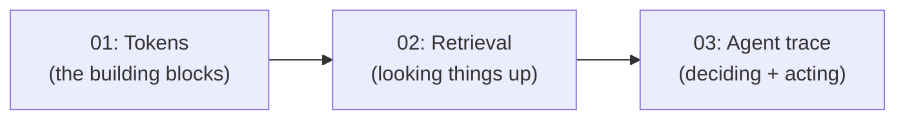

# k-ai-basics

> Clone it, run one command, and watch how AI actually works — right in your terminal. No sign-ups, no cloud, no credit card.

[](https://khadir-syed.github.io/)
[](LICENSE)

## What this is (and isn't)

This is for someone who is still trying to get a clue of what "AI" even
is. You clone the repo, run a short command, and *see* the concept happen
in plain text on your screen — no theory slides, no black box.

It is **not** a framework you build on top of, and it is **not**
production code. There is no LangChain, no CrewAI, no deployment, no
Docker, no server. Every demo runs on your own laptop and does one thing
clearly.

## The demos

| # | Demo | What it shows you | Run command | Needs an API key? |
|---|------|--------------------|--------------|--------------------|
| 01 | [Tokenizer Playground](01-tokenizer-playground/) | AI doesn't read words — it reads small pieces called tokens, and guesses one at a time | `python run.py "your sentence"` | No |
| 02 | [Mini-RAG in a Terminal](02-mini-rag/) | How AI "looks things up" in documents before it answers | `python ask.py "your question"` | No (optional) |
| 03 | Agent Trace CLI *(coming soon)* | What an "agent" actually does, step by step: think → use a tool → answer | `python trace.py "your task"` | No (optional) |

## Which one should I run first?

Run them **in order: 01 → 02 → 03**. Each one builds on the idea before
it:

1. **01** shows you the smallest building block — a token.
2. **02** shows AI using a pile of tokens (documents) to find an answer.
3. **03** shows AI deciding *when* to go look something up versus just
   answering — the first taste of "agent" behavior.

Skipping ahead works fine too, but the ideas click faster in this order.



## How to install and run a demo

1. Make sure Python is installed on your computer.
2. Open a terminal and go into the demo folder you want to try, for example:

   ```bash
   cd 01-tokenizer-playground
   ```

3. Install that demo's own small set of requirements:

   ```bash
   pip install -r requirements.txt
   ```

4. Run it, following that demo's own README for the exact command.

Each demo folder is self-contained — its own `requirements.txt`, its own
README, nothing shared. Copy just that one folder anywhere and it still
works.

## Where to go next

Once you've run all three and want to see what the "real," full-power
version of these ideas looks like — the actual skills, agents, and
orchestration layers this repo simplifies — head to the tech-version
repos in the `k-` series. Links to all of them: **https://khadir-syed.github.io/**

## License

MIT — see [LICENSE](LICENSE).
