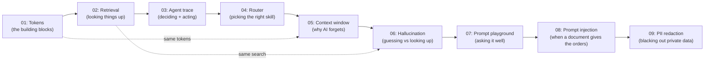

# k_ai-basics

> Clone it, run one command, and watch how AI actually works — right in your terminal. No sign-ups, no cloud, no credit card.

[](https://khadir-syed.github.io/)
[](LICENSE)

## See it in 5 seconds

This is what it looks like when you ask Demo 03 a question. You get to
watch the AI **think**, **pick a tool**, **use it**, and **answer** — step
by step, nothing hidden:

```
$ python trace.py "what is 12 times 4"
📄 Rule-based mode — a regex decides which tool to use:

[THINKING] Checking whether this needs a tool...
[TOOL CALL] calculator("12 * 4")
[TOOL RESULT] 48
[FINAL ANSWER] 12 * 4 = 48
```

> 📅 Example output, as of 23 September 2026. Every demo's README shows its
> own example output like this, so you know what to expect before you run it.

## What this is (and isn't)

This is for someone who is still trying to get a clue of what "AI" even
is. You clone the repo, run a short command, and *see* the concept happen
in plain text on your screen — no theory slides, no black box.

It is **not** a framework you build on top of, and it is **not**
production code. There is no LangChain, no CrewAI, no deployment, no
Docker, no server. Every demo runs on your own laptop and does one thing
clearly.

## The demos

| # | Demo | What it shows you | Run command | Needs an API key? |
|---|------|--------------------|--------------|--------------------|
| 01 | [Tokenizer Playground](01-tokenizer-playground/) | AI doesn't read words — it reads small pieces called tokens, and guesses one at a time | `python run.py "your sentence"` | No |
| 02 | [Mini-RAG in a Terminal](02-mini-rag/) | How AI "looks things up" in documents before it answers | `python ask.py "your question"` | No (optional) |
| 03 | [Agent Trace CLI](03-agent-trace/) | What an "agent" actually does, step by step: think → use a tool → answer | `python trace.py "your task"` | No (optional) |
| 04 | [Router Playground](04-router-playground/) | How AI decides which tool/skill to use for a request | `python router.py "your request"` | No (optional) |
| 05 | [Context Window Explorer](05-context-window/) | Why AI "forgets" the start of a long chat — it only has room for so many tokens | `python explore.py` | No |
| 06 | [Hallucination Demo](06-hallucination-demo/) | Why looking things up matters — without documents, AI can only guess, and a guess can sound sure | `python compare.py "your question"` | No (optional — best with one) |
| 07 | [Prompt Engineering Playground](07-prompt-playground/) | Small wording changes to a prompt change the answer a lot — see real before/after answers, and check your own prompt | `python playground.py` | No (optional) |
| 08 | [Prompt Injection Demo](08-prompt-injection/) | A hidden instruction inside a document can hijack an AI — and a simple filter only catches the attacks it already knows | `python inject.py` | No (optional) |
| 09 | [PII Redaction Demo](09-pii-redaction/) | Black out private data (ID numbers, cards, emails) before an AI sees it — and see what simple patterns miss | `python redact.py` | No |

## Which one should I run first?

Run them **in order: 01 → 02 → 03 → 04 → 05 → 06 → 07 → 08 → 09**. Each one builds on the idea
before it:

1. **01** shows you the smallest building block — a token.
2. **02** shows AI using a pile of tokens (documents) to find an answer.
3. **03** shows AI deciding *when* to go look something up versus just
   answering — the first taste of "agent" behavior.
4. **04** pulls that decision step out on its own, scoring several
   possible skills side by side — the first taste of a full multi-agent
   system, where the hard part is picking the *right* specialist.
5. **05** goes back to 01's tokens and shows why they matter in a chat:
   the AI can only hold so many at once, so the oldest messages fall off.
6. **06** goes back to 02's "look it up first" and shows why it matters:
   the same question, answered with no documents (a guess) and with them.
7. **07** is the finishing skill: now that you know how AI works, learn to
   *ask* it well. It stands on its own, so you can also try it any time.
8. **08** is a quick look at how things go wrong: a document can carry its
   own sneaky prompt, written by an attacker instead of you.
9. **09** is the other side of the same coin: instead of bad instructions
   getting *in*, it's private data getting *out* — and how to black it out
   first.

Skipping ahead works fine too, but the ideas click faster in this order.



## How to install and run a demo

1. Make sure Python is installed on your computer.
2. Open a terminal and go into the demo folder you want to try, for example:

   ```bash
   cd 01-tokenizer-playground
   ```

3. Install that demo's own small set of requirements:

   ```bash
   pip install -r requirements.txt
   ```

4. Run it, following that demo's own README for the exact command.

Each demo folder is self-contained — its own `requirements.txt`, its own
README, nothing shared. Copy just that one folder anywhere and it still
works.

Demos with an optional `--key` mode each carry their own copy of the same
small file, `llm.py`, which does the talking to the AI company. The copies
are kept identical, and you can check that anytime from this folder:

```bash
python3 check_llm_copies.py
```

## Where to go next

Once you've run them all and want to see what the "real," full-power
version of these ideas looks like — the actual skills, agents, and
orchestration layers this repo simplifies — **04's router is the bridge**:
it's a simplified mirror of the `request-router-agent` in
[`k_ai-agent-skills`](https://github.com/khadir-syed/k_ai-agent-skills),
which routes real work to real agents with human checkpoints. From there,
head to the tech-version repos in the `k-` series. Links to all of them:
**https://khadir-syed.github.io/**

## License

MIT — see [LICENSE](LICENSE).
