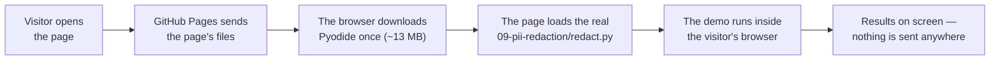

# Web version: the demos in your browser

**Try it:** https://khadir-syed.github.io/k_ai-basics/web/

Right now: **Demo 09 (Hide private info from AI)**. More demos will follow.

## What is this?

Most demos in this repo run in a terminal, which is great for coders but a
wall for everyone else. This folder turns a demo into a web page anyone can
open — on a laptop or a phone, with nothing to install.

Think of it like a recipe card and a travelling kitchen. The recipe (the
demo's Python code) stays exactly the same. What's new is a small kitchen
that arrives in your browser the first time you open the page — a tool
called **Pyodide**, which is Python itself, rebuilt to run inside a web
page. Your browser downloads it once (about 13 MB), then cooks the same
recipe right there on your own device.

That means:

- **The page runs the real demo code.** It loads
  [`09-pii-redaction/redact.py`](../09-pii-redaction/redact.py) itself — not a
  copy — so the terminal and the web page can never tell different stories.
- **Nothing you type leaves your device.** There is no server of ours and no
  database. GitHub only hands your browser the files; everything happens on
  your phone or computer.
- **There is no `--key` mode on the web.** The web version never talks to an
  AI company.

## How it works, in a picture



## What's in this folder

| File | What it does |
|---|---|
| [`index.html`](index.html) | The page. **All the English text lives here**, so it reads instantly — even before (or without) any scripts. |
| [`app.js`](app.js) | Loads Pyodide, gives it the real `redact.py` and its `docs/`, runs it, and shows the results. Also re-checks the 6 examples live. |
| [`style.css`](style.css) | Colours and layout, matching https://khadir-syed.github.io |
| [`test_web.py`](test_web.py) | Self-check: every example shown on the page must be exactly what the real code produces. |

The repo root also has an [`index.html`](../index.html) that simply forwards
visitors from `khadir-syed.github.io/k_ai-basics/` to this page.

---

*The rest of this page is for whoever looks after the web version.*

## Test it on your own computer

**1. From the repo's top folder, start a tiny local web server:**

```bash
python3 -m http.server 8409
```

**2. Open this address in your browser:**

```text
http://localhost:8409/web/
```

(Opening `index.html` by double-clicking won't work — browsers block pages
opened as files from loading other files.)

**3. Run the self-check:**

```bash
python web/test_web.py
```

It checks that the 6 examples on the page — the input, what the AI would
see, and the ✅/❌ — match what `redact.py` really does, and that the
tap-to-try buttons offer the same 6 examples. If you change the demo's
patterns or an example, run it before you commit.

## How publishing works

Every push to `main` runs the workflow in
[`.github/workflows/pages.yml`](../.github/workflows/pages.yml), which
publishes the repo to GitHub Pages in about a minute. It publishes the
**whole repo**, because the page loads the demo's own `.py` file from its
folder.

One setting must stay on in the repo: **Settings → Pages → Build and
deployment → Source: "GitHub Actions"**.

The workflow's actions are pinned to exact commits (the long codes after
`@`), with the version in a comment next to each. That way a changed or
compromised release can't slip in. To update one, look up the new release's
full commit code on that action's GitHub page, and change both the code and
the comment.

## Upgrading Pyodide (read this first!)

Pyodide is pinned to one exact version, and the page checks the loader file
against a fingerprint (the `integrity="sha384-…"` in `index.html`). If the
file doesn't match the fingerprint, **the browser refuses to run it** — so
if you change the version without changing the fingerprint, the page
silently stops working.

The version appears in **two** places — change both, to the same number:

- `index.html`: the `<script src="https://cdn.jsdelivr.net/npm/pyodide@…/pyodide.js">` line
- `app.js`: the `PYODIDE_URL` line

Then make the new fingerprint (replace `NEW_VERSION`, e.g. `314.0.8`):

```bash
curl -s https://cdn.jsdelivr.net/npm/pyodide@NEW_VERSION/pyodide.js | openssl dgst -sha384 -binary | openssl base64 -A
```

Put `sha384-` in front of what it prints, and use that as the new
`integrity="…"` value in `index.html`. Then test it locally (above) before
you commit: if the page says "Sorry — the demo couldn't load", the
fingerprint or version is wrong.

## Security rules for these pages

- **Strict content rules.** Each page has a `Content-Security-Policy` that
  only lets it load its own files and the pinned Pyodide from jsDelivr. No
  other website can be contacted.
- **No scripts inside the HTML.** Scripts live in `app.js` only.
- **Text is always shown as plain text** (`textContent`), never as HTML —
  so nothing typed into the page can turn into code.
- **No cookies, no storage, no analytics, no tracking,** and no forms that
  send anything anywhere.
- **Only made-up data** in examples: ID numbers starting with `000`,
  standard test card numbers, and emails at `example.com`.

## Bringing another demo to the web

The plan is to follow the same pattern: the page loads the demo's own
unchanged `.py` file with Pyodide, leads with a few clear ✅/❌ examples in
plain words, lets people tap to try, and gets a `test_web.py` check so the
examples can't drift from the code. Demos 01 and 05 need large AI models
that are too big for a browser, so they will need a lighter approach.
