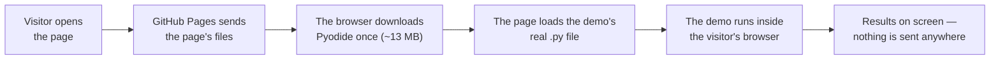

# Web version: the demos in your browser

**Try it:** https://khadir-syed.github.io/k_ai-basics/web/

Right now:

- **Demo 02 — How AI looks things up:** https://khadir-syed.github.io/k_ai-basics/web/02/
- **Demo 03 — Watch an AI agent think:** https://khadir-syed.github.io/k_ai-basics/web/03/
- **Demo 04 — Who should handle this?:** https://khadir-syed.github.io/k_ai-basics/web/04/
- **Demo 06 — When AI makes things up:** https://khadir-syed.github.io/k_ai-basics/web/06/
- **Demo 07 — Ask AI better:** https://khadir-syed.github.io/k_ai-basics/web/07/
- **Demo 08 — Hidden orders in documents:** https://khadir-syed.github.io/k_ai-basics/web/08/
- **Demo 09 — Hide private info from AI:** https://khadir-syed.github.io/k_ai-basics/web/09/
- **Demo 10 — Two agents, one job:** https://khadir-syed.github.io/k_ai-basics/web/10/

More demos will follow.

## What is this?

Most demos in this repo run in a terminal, which is great for coders but a
wall for everyone else. This folder turns a demo into a web page anyone can
open — on a laptop or a phone, with nothing to install.

Think of it like a recipe card and a travelling kitchen. The recipe (the
demo's Python code) stays exactly the same. What's new is a small kitchen
that arrives in your browser the first time you open the page — a tool
called **Pyodide**, which is Python itself, rebuilt to run inside a web
page. Your browser downloads it once (about 13 MB), then cooks the same
recipe right there on your own device.

That means:

- **Each page runs the real demo code.** The Demo 09 page loads
  [`09-pii-redaction/redact.py`](../09-pii-redaction/redact.py) itself — not a
  copy — so the terminal and the web page can never tell different stories.
  The Demo 07 page does the same with
  [`07-prompt-playground/playground.py`](../07-prompt-playground/playground.py),
  and shows the real AI answers saved in its
  [`saved_answers.json`](../07-prompt-playground/saved_answers.json).
  Demo 02 loads [`02-mini-rag/ask.py`](../02-mini-rag/ask.py) and its
  stories (Demo 06 does the same with
  [`06-hallucination-demo/compare.py`](../06-hallucination-demo/compare.py)
  and its Puddlewick files), Demo 03 loads
  [`03-agent-trace/trace.py`](../03-agent-trace/trace.py), Demo 04
  [`04-router-playground/router.py`](../04-router-playground/router.py),
  Demo 08 [`08-prompt-injection/inject.py`](../08-prompt-injection/inject.py)
  and its documents, and Demo 10
  [`10-multi-agent-handoff/handoff.py`](../10-multi-agent-handoff/handoff.py).
- **Demos 02 and 06 ask before their big download.** Their search uses scikit-learn,
  which adds about 22 MB, so nothing downloads until the visitor taps
  "Load the search" (up to 35 MB in all). The browser gets scikit-learn
  1.8.0 — the version Pyodide ships — while the terminal uses 1.9.1; the
  page re-checks its 6 examples live, so a difference would show up.
- **Nothing you type leaves your device.** There is no server of ours and no
  database. GitHub only hands your browser the files; everything happens on
  your phone or computer.
- **There is no `--key` mode on the web.** The web version never talks to an
  AI company. Demo 07 shows answers a real AI gave earlier, saved in the repo,
  Demo 06 shows a real AI's answers to its 6 questions, both ways, and
  Demo 10 shows one saved real run of its two agents.
  Demos 04, 08 and 10 run their rule-based mode — the same as the terminal
  without `--key`.

## How it works, in a picture



## What's in this folder

| File | What it does |
|---|---|
| [`index.html`](index.html) | The home page: the brand header and a card for each demo. No scripts at all. The photo (and every page's tab icon) loads straight from the GitHub profile, so a new profile photo shows up by itself — no image files are kept here. |
| `02/`, `03/`, `04/`, `06/`, `07/`, `08/`, `09/`, `10/` — each one's `index.html` | One page per demo. **All the English text lives here**, so it reads instantly — even before (or without) any scripts. |
| [`02/app.js`](02/app.js) | When the visitor taps "Load the search": loads Pyodide and scikit-learn, gives it the real `ask.py` and the 4 stories, re-checks the 6 examples live, then shows the top 5 matching paragraphs for any question. |
| [`03/app.js`](03/app.js) | Loads Pyodide with the real `trace.py`, re-checks the 6 examples live, and shows every step the agent takes on your own question. |
| [`04/app.js`](04/app.js) | Loads Pyodide with the real `router.py`, re-checks the 6 examples live, and scores the 3 skills for your own request. |
| [`06/app.js`](06/app.js) | When the visitor taps "Load the search": loads Pyodide and scikit-learn, gives it the real `compare.py` and the 3 Puddlewick files, re-checks the look-up side of the 6 examples live, then shows the top 3 paragraphs (✓ or ✗ at the 10% line) and the best evidence — or "I don't know" — for any question. |
| [`07/app.js`](07/app.js) | Shows the saved AI answers (first 3 lines, then "Show all"), loads Pyodide with the real `playground.py`, and runs its checklist on your own question. Also re-checks the 4 examples live. |
| [`07/markdown.js`](07/markdown.js) | AI tools write answers with formatting symbols (`##` heading, `**bold**`, `\| tables \|`). This turns them into real headings, lists and tables — safely: text always goes into the page as plain text, never as code. |
| [`08/app.js`](08/app.js) | Loads Pyodide with the real `inject.py` and its 3 documents, re-checks the 4 steps live, and runs any document you write through the filter (on or off) and the mock agent. |
| [`09/app.js`](09/app.js) | Loads Pyodide, gives it the real `redact.py` and its `docs/`, runs it, and shows the results. Also re-checks the 6 examples live. |
| [`10/app.js`](10/app.js) | Loads Pyodide with the real `handoff.py`, re-checks the 6 examples live, runs the real JSON check on the saved real-AI reply, and runs both agents on your own bug report, handed over as JSON or plain text. |
| [`style.css`](style.css) | Colours and layout for every page, matching https://khadir-syed.github.io |
| [`test_web.py`](test_web.py) | Self-check: every example shown on a page must be exactly what the real code produces. |

The repo root also has an [`index.html`](../index.html) that simply forwards
visitors from `khadir-syed.github.io/k_ai-basics/` to the home page.

---

*The rest of this page is for whoever looks after the web version.*

## Test it on your own computer

**1. From the repo's top folder, start a tiny local web server:**

```bash
python3 -m http.server 8409
```

**2. Open this address in your browser:**

```text
http://localhost:8409/web/
```

(Opening `index.html` by double-clicking won't work — browsers block pages
opened as files from loading other files.)

**3. Run the self-check:**

```bash
python web/test_web.py
```

The Demo 02 checks need scikit-learn. If Demo 02's box is set up (see its
[README](../02-mini-rag/README.md#how-to-run-it-step-by-step)), run it with
that box's Python so nothing is skipped:

```bash
02-mini-rag/.venv/bin/python web/test_web.py
```

It checks that:

- **Demo 09:** the 6 examples — the input, what the AI would see, and the
  ✅/❌ — match what `redact.py` really does, and the tap-to-try buttons
  offer the same 6 examples.
- **Demo 06:** the file list matches its `docs/`, every example shows both
  saved AI answers, the page names the date and model, and the tap-to-try
  buttons offer the same 6 questions. With scikit-learn, it also checks each
  example's look-up side — the best paragraph, its %, and how many
  paragraphs cleared 10% — against `compare.py`.
- **Demo 07:** the 4 pairs — the prompts, "What changed" and the checklist
  scores — match `playground.py`, and the model name and date match
  `saved_answers.json`. It also runs `markdown.js` on all 8 saved answers
  (this part needs [Node.js](https://nodejs.org); it's skipped without it)
  and checks no formatting symbols are left over and no words go missing.
- **Demo 03:** the 6 examples — every step the agent takes — match what
  `trace.py` really prints, and the tap-to-try buttons offer the same 6.
- **Demo 04:** the 6 examples match what `router.py` really prints, the
  page lists the router's real skills, and the tap-to-try buttons offer the
  same 6.
- **Demo 08:** the 4 steps are the terminal version's 4 steps, in order, and
  match what `inject.py` really prints; the try-it buttons load exactly the
  files in its `docs/`.
- **Demo 10:** the 6 examples (each with its handoff format) match what
  `handoff.py` really prints, and the tap-to-try buttons offer the same bug
  reports. For the saved real-AI run, the Drafter's reply really passes
  `check_json`, and the page's notes about it (4 invented steps sent as a
  list, "data loss" in Triage's answer, the date and model) really hold.
- **Demo 02:** the story list matches the files in `docs/`, the 6 examples
  show the paragraph `ask.py` really picks (or "nothing found"), and the
  tap-to-try buttons offer the same 6. Without scikit-learn, this part is
  skipped with a note.
- **Every page** uses the same Pyodide version, and the home page links to
  every demo.

If you change a demo's code or an example, run it before you commit.

## How publishing works

Every push to `main` runs the workflow in
[`.github/workflows/pages.yml`](../.github/workflows/pages.yml), which
publishes the repo to GitHub Pages in about a minute. It publishes the
**whole repo**, because the page loads the demo's own `.py` file from its
folder.

One setting must stay on in the repo: **Settings → Pages → Build and
deployment → Source: "GitHub Actions"**.

The workflow's actions are pinned to exact commits (the long codes after
`@`), with the version in a comment next to each. That way a changed or
compromised release can't slip in. To update one, look up the new release's
full commit code on that action's GitHub page, and change both the code and
the comment.

## Upgrading Pyodide (read this first!)

Pyodide is pinned to one exact version, and the page checks the loader file
against a fingerprint (the `integrity="sha384-…"` in `index.html`). If the
file doesn't match the fingerprint, **the browser refuses to run it** — so
if you change the version without changing the fingerprint, the page
silently stops working.

The version appears in **two** places on **each** demo page (`02/`, `03/`,
`04/`, `06/`, `07/`, `08/`, `09/` and `10/`), plus a third in `02/app.js` and `06/app.js` — change them all, to the
same number:

- `index.html`: the `<script src="https://cdn.jsdelivr.net/npm/pyodide@…/pyodide.js">` line
- `app.js`: the `PYODIDE_URL` line
- `02/app.js` and `06/app.js` only: the `PACKAGES_URL` line, where they get scikit-learn

(`python web/test_web.py` fails if they don't all match.)

Then make the new fingerprint (replace `NEW_VERSION`, e.g. `314.0.8`):

```bash
curl -s https://cdn.jsdelivr.net/npm/pyodide@NEW_VERSION/pyodide.js | openssl dgst -sha384 -binary | openssl base64 -A
```

Put `sha384-` in front of what it prints, and use that as the new
`integrity="…"` value in each demo's `index.html`. Then test it locally (above) before
you commit: if the page says "Sorry — the demo couldn't load", the
fingerprint or version is wrong.

## Security rules for these pages

- **Strict content rules.** Each page has a `Content-Security-Policy` that
  only lets it load its own files, the pinned Pyodide from jsDelivr, and the
  GitHub profile photo (the home page: its own files and the photo only). No
  other website can be contacted. Demos 02 and 06 get scikit-learn from
  jsDelivr, and Pyodide checks each of its files against a fingerprint
  before using it.
- **No scripts inside the HTML.** Scripts live in each demo's `app.js` only.
- **Text is always shown as plain text** (`textContent`), never as HTML —
  so nothing typed into the page can turn into code.
- **No cookies, no storage, no analytics, no tracking,** and no forms that
  send anything anywhere.
- **Only made-up data** in examples: ID numbers starting with `000`,
  standard test card numbers, and emails at `example.com`.

## Bringing another demo to the web

Follow the same pattern as the other pages, like `09/`:

1. Make a folder `web/NN/` with an `index.html` and an `app.js`. The page
   loads the demo's own unchanged `.py` file with Pyodide, leads with a few
   clear ✅/❌ examples in plain words, and lets people tap to try.
2. Add a card for it on the home page, [`index.html`](index.html).
3. Add its checks to [`test_web.py`](test_web.py), so the examples can't
   drift from the code.
4. Add a browser link to the top of the demo's own README, and update the
   list at the top of this file and in the root README.

Demos 01 and 05 need large AI models that are too big for a browser, so
they will need a lighter approach.
